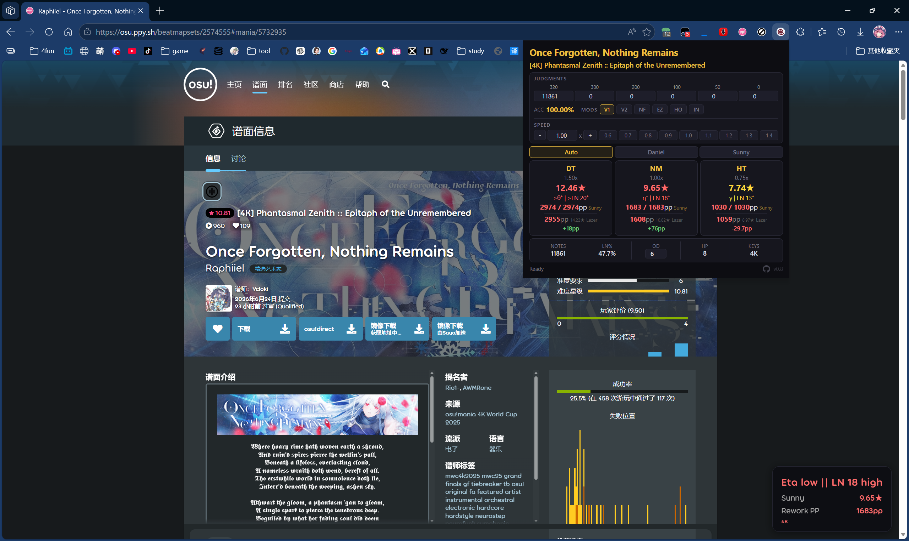
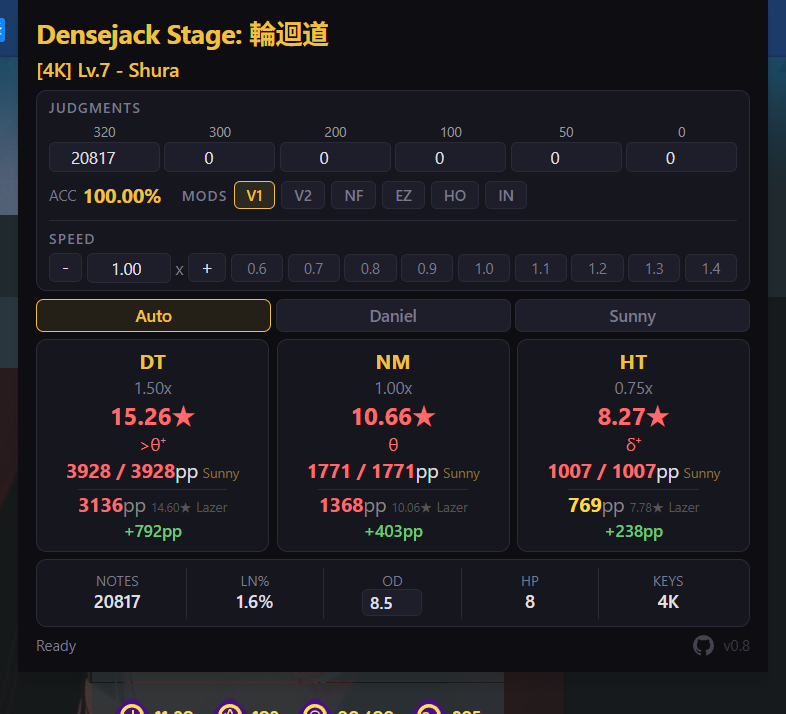
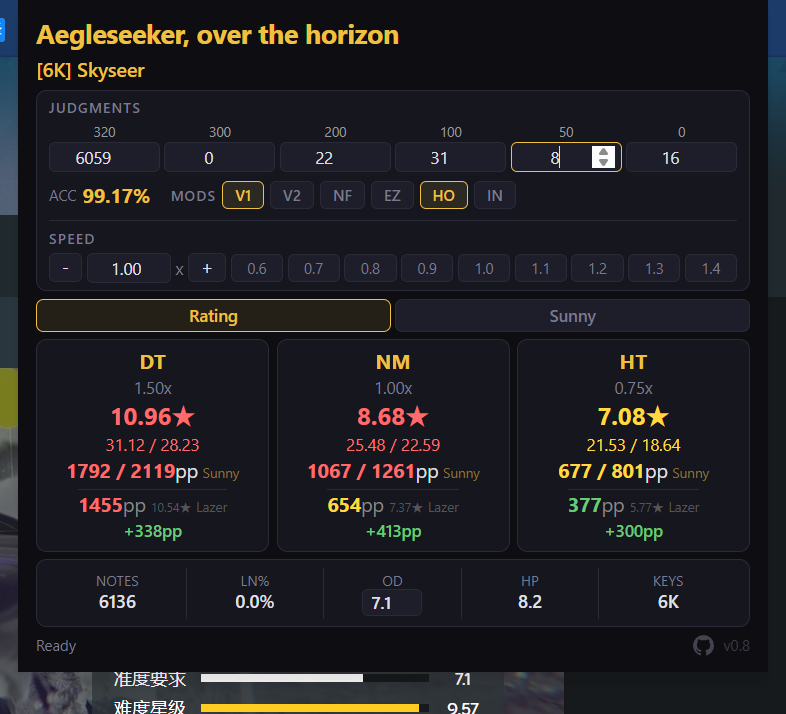
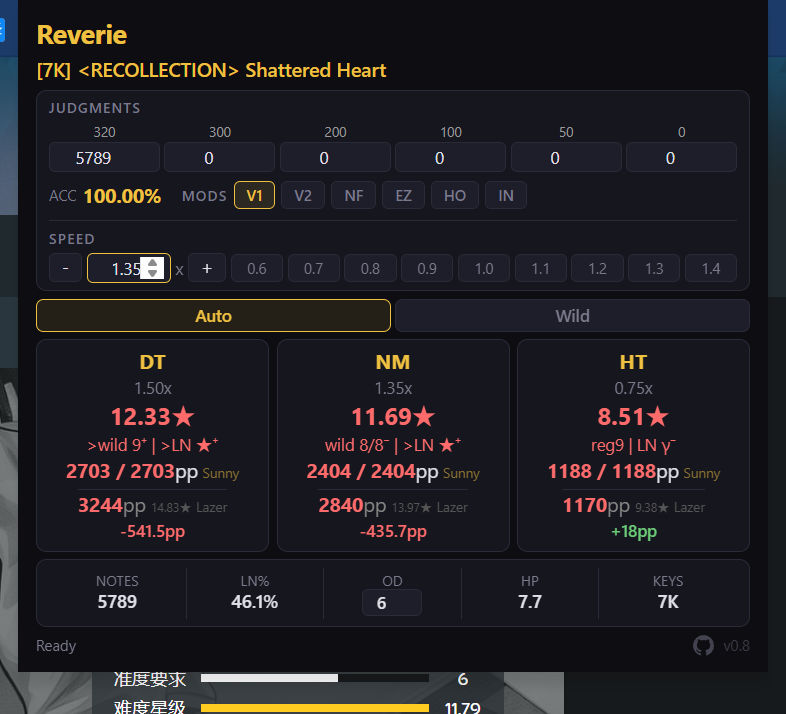
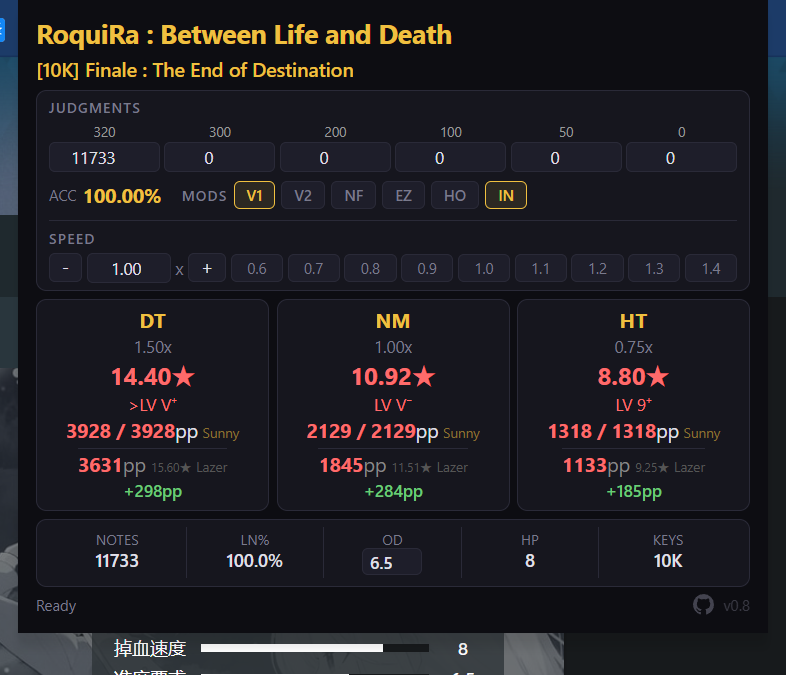
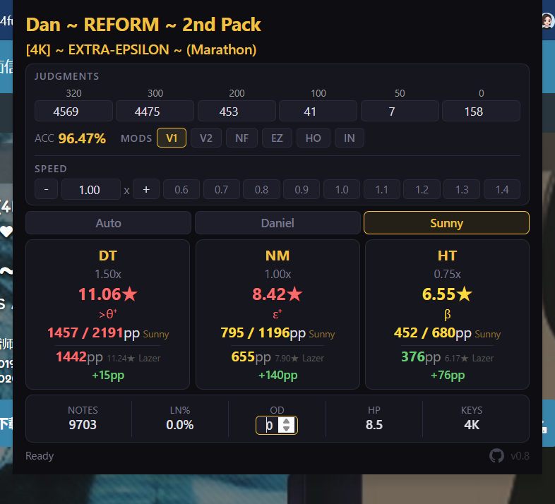

# mania-sunny-rework-web

A Chrome extension (compatible with Edge and other Chromium browsers) for osu!mania beatmap difficulty and PP estimation based on [Sunny Rework](https://github.com/sunnyxxy/Star-Rating-Rebirth). View Sunny Rework star ratings, RC/LN tiers, real-time PP calculations, and [6K difficulty constant / Rating](https://github.com/IceRain5491/ManiaMapWorkshop) estimates directly on osu! beatmap pages.

> [中文版 (Chinese)](./README.md)



---

## Features

- **Sunny Rework Stars** — Star rating estimation for 4K/6K/7K/10K using the Sunny Rework algorithm
- **Daniel Algorithm** — 4K RC tier estimation (Alpha ~ Theta)
- **6K Rating Mode** — Displays 6K difficulty constant and Acc-based Rating
- **7K Wild Mode** — 7K supports Auto / Wild algorithm toggle
- **RC / LN Tiers** — Auto-displays RC tier or RC+LN mixed tier based on LN ratio
- **PP Estimation** — Real-time PP for NM/DT/HT columns, supports custom speed (0.5x ~ 2.0x)
- **MOD Support** — Mod combinations: SV1/SV2/NF/EZ/HO/IN and more
- **Custom OD** — Independently adjust OD value, auto-recalculates star rating
- **Judgment Input** — Manually enter judgment counts to compute actual accuracy PP
- **HO/IN Toggle** — One-click switch between HO (rice only) and IN (reverse) modes with separate star/PP calculations

---

## Installation

> For browsers other than Chrome, please search for "how to load unpacked extensions" for your specific browser.

1. Download the repository ZIP or `git clone`
2. Open Chrome, go to `chrome://extensions/`
3. Enable "Developer mode"
4. Click "Load unpacked" and select the repository folder
5. Open any osu! beatmap page (e.g. `https://osu.ppy.sh/beatmapsets/xxx#mania/xxx`)
6. A persistent difficulty analysis badge appears at the bottom-right corner
7. Click the extension icon to view the full analysis panel

[Video Tutorial](https://www.bilibili.com/video/BV1RPgd6VEUB)

> ⚠️ **When updating the extension, always "Remove" first, then "Load unpacked" again. Clicking the refresh button directly may leave stale code and cause issues (the developer wasted a lot of time debugging this).**

---

## Usage

| Feature | Description |
|---------|-------------|
| **DT / NM / HT** | Three columns showing 1.5x / 1.0x / 0.75x star ratings and PP |
| **Speed Slider** | Custom speed from 0.5x ~ 2.0x with preset shortcut buttons |
| **Judgment Input** | Enter 320/300/200/100/50/miss counts for real-time PP |
| **Algorithm Switch** | 4K: Auto / Daniel / Sunny; 6K: Rating / Sunny; 7K: Auto / Wild |
| **MOD Buttons** | Toggle SV1/SV2/NF/EZ/HO/IN, auto-recalculates |
| **Custom OD** | Modify OD value, triggers automatic recalculation |

---

## How the Extension Works

### Overall Architecture

The extension consists of two main parts:

1. **Content Script**: Injected into osu! beatmap pages, it extracts the beatmap ID, downloads the `.osu` file, runs the full difficulty algorithm, renders a persistent badge at the bottom-right corner, and writes results to `chrome.storage.local`.
2. **Popup**: Opened by clicking the extension icon, it reads data from `chrome.storage.local` and displays NM/DT/HT columns, judgment inputs, PP, tiers / difficulty constant, and mod options.

### Data Flow

```
User opens an osu! beatmap page
    ↓
Content Script extracts beatmapId
    ↓
Requests https://osu.ppy.sh/osu/{beatmapId} to download the raw .osu file
    ↓
OsuParser parses the beatmap (judgments, columns, timing, LNs, OD/HP, etc.)
    ↓
Star-Rating-Rebirth algorithm calculates NM / DT / HT star ratings
    ↓
RC/LN tiers (or 6K difficulty constant) are computed based on LN ratio, key count, and mode
    ↓
Results are stored in chrome.storage.local
    ↓
Popup reads and renders NM/DT/HT columns + PP + tiers / difficulty constant
```

### Star Rating Calculation

The core algorithm is Sunny Rework (Star-Rating-Rebirth). The Content Script runs the full algorithm three times per beatmap:

- **NM**: Base speed `1.0x`
- **DT**: 1.5x speed; internally multiplies note timestamps by `2/3`
- **HT**: 0.75x speed; internally multiplies note timestamps by `4/3`

For HO / IN modes, the raw `.osu` text is transformed before running the NM algorithm, and DT/HT values are derived from the NM ratio:

- **HO (Hold Off)**: Converts all long notes into regular notes, simulating a rice-only chart.
- **IN (Invert)**: Converts each gap between consecutive notes in the same column into a long note, matching osu!'s official Invert mod algorithm (`duration = max(gap/2, gap - beatLength/4)`).

### Tier / Difficulty Constant Calculation

*Note: when both RC tier and LN tier are displayed, the RC tier uses the Sunny Rework tier table difficulty under HO mod, or (4K only) the difficulty estimated by the Daniel algorithm.*

#### 4K



- **Auto**: Uses Daniel algorithm when 4K Daniel difficulty ≥ 6.365, otherwise Sunny Rework.
- **Daniel**: Forces Daniel algorithm for Alpha ~ Theta tier estimation (treats LNs as rice).
- **Sunny**: Forces Sunny Rework RC4K_Reform tier table, supports Intro 1 to Theta (DDMythical's RC Dan & Emik's Zeta Dan & Thaumiel's Eta Dan & CloverWisp's Theta Dan).

If LN ratio ≥ 15%, both RC and LN tiers are displayed, e.g. `rf8/8⁻ | LN 11⁻`.

#### 6K



- **Rating**: Displays the **difficulty constant** (`diff_const = SR × 200/81 + 7/6`) and computes **Rating** from 310-weight accuracy (used internally only, not displayed).
- **Sunny**: Displays the RC6K tier table (Arkman's Regular Dan & sunnyxxy's LN Dan).

The badge defaults to showing the difficulty constant for 6K beatmaps.

#### 7K



- **Auto**: Uses the Regular/LN 7K tier table, and supplements with Wild 8 and 9 Dan (tyrcs's Wild Dan) above Stellium Dan.
- **Wild**: Uses the Wild 7K tier table, only for rice charts above 10 Dan (Jinjin's Dan).

#### 10K



Directly displays the RC10K tier table with no additional mode switch (CT's Dan).

### PP Calculation

Each column shows two PP values:

1. **Sunny PP**: Based on Sunny Rework SR and the `computeSunnyPP` formula; supports real-time Acc adjustment from miss/judgment inputs.
2. **Lazer PP**: Based on osu!lazer official SR and the `computeOfficialPP` formula.

Their difference is shown as `+/-Xpp` in the badge.

### Judgments and Accuracy

- Input fields support 320 / 300 / 200 / 100 / 50 / miss.
- Displayed Acc follows SV1 (320 weight for colorful judgments) or SV2 (305 weight) settings.
- 6K Rating mode internally uses **310-weight Acc** for Rating calculation, without affecting the displayed Acc.

### Custom OD

When OD is changed, the Popup sends a `recalculateOd` message to the Content Script, which re-runs NM/DT/HT algorithms with the new OD and updates storage — no page refresh needed.



---

## Algorithm & Project References

- [Sunny Rework](https://github.com/sunnyxxy/Star-Rating-Rebirth) — Core star rating algorithm
   - [@sunnyxxy](https://github.com/sunnyxxy)
- [Daniel](https://github.com/TheBagelOfMan/Daniel) — 4K RC tier estimation
   - [@TheBagelOfMan](https://github.com/TheBagelOfMan)
- [osumania_map_analyser](https://github.com/LeoBlackMT/osumania_map_analyser) — RC/LN tier mapping reference
   - [@LeoBlackMT](https://github.com/LeoBlackMT) and myself
- [ManiaMapWorkshop](https://github.com/IceRain5491/ManiaMapWorkshop) — 6K Rating and difficulty constant algorithm
   - [@IceRain5491](https://github.com/IceRain5491)

## License

MIT
